<h1 align="center">🌊 Telegram-Stream</h1>

<p align="center">
  <b>High-Performance Telegram File Streaming & Direct Download Bot with Premium Web UI</b>
</p>

<p align="center">
  <a href="https://github.com/ilhambintang17/Telegram-Stream">
    
  </a>
  <a href="https://github.com/ilhambintang17/Telegram-Stream/fork">
    
  </a>
  <a href="https://github.com/ilhambintang17/Telegram-Stream/blob/main/LICENSE">
    
  </a>
</p>

---

## 📸 Preview


---

## ✨ Features

### 🎨 Premium UI/UX
- **Glassmorphism Design** - Modern dark-themed interface with blur effects and gradients
- **Plyr.js Video Player** - Advanced playback with custom controls
- **Responsive Layout** - Full-width video on mobile, optimized for all devices
- **Custom Skip Controls** - `-10m`, `-1m`, `-10s`, `+10s`, `+1m`, `+10m` buttons
- **Double-Tap Mobile Skip** - YouTube-style ±10s skip in fullscreen mode
- **Series Thumbnails** - Auto-generated thumbnails for video files

### ⚡ Performance & Reliability
- **Multi-Client Rotation System** - Automatic FloodWait avoidance with up to 50 bot clients
- **LFU-Based Media Cache** - Intelligent caching with configurable size limit
- **Smart Pre-Caching** - Predicts and pre-downloads next episode in series
- **Background Downloads** - Non-blocking file downloads with client rotation
- **Pagination** - Smooth browsing of channels with thousands of files

### 🎬 Video Features  
- **MKV Subtitle Extraction** - Extracts embedded ASS/SSA subtitles using FFmpeg
- **SubtitlesOctopus Integration** - Renders complex subtitles in browser
- **External Player Links** - One-click deep links to MX Player & VLC
- **Direct Download** - Resumable download links

### 📁 Content Management
- **Multi-Channel Index** - Index multiple Telegram channels
- **Series Grouping** - Automatically groups multi-part files (e.g., `video.part01.mkv`)
- **Playlist Creator** - Create folders and organize files with custom thumbnails
- **Search Support** - Regex-based file search across channels
- **Admin Dashboard** - Cache statistics and configuration management

---

## 🏗️ Architecture

```mermaid
flowchart TB
    subgraph Client["🖥️ Web Client"]
        Browser["Browser"]
        Plyr["Plyr.js Player"]
        SubOctopus["SubtitlesOctopus"]
    end
    
    subgraph Server["⚙️ Aiohttp Server"]
        Routes["Stream Routes"]
        RenderTemplate["Template Engine"]
        MediaCache["LFU Media Cache"]
        SubCache["Subtitle Cache"]
        SubExtractor["FFmpeg Subtitle Extractor"]
    end
    
    subgraph Telegram["📱 Telegram API"]
        StreamBot["Main Bot Client"]
        UserBot["User Session"]
        MultiClient["Multi-Client Pool<br/>(up to 50 bots)"]
    end
    
    subgraph Storage["💾 Storage"]
        MongoDB[(MongoDB)]
        LocalCache[("Local Cache<br/>(Configurable GB)")]
    end
    
    Browser --> Routes
    Routes --> RenderTemplate
    Routes --> MediaCache
    
    MediaCache -->|Cache HIT| LocalCache
    MediaCache -->|Cache MISS| MultiClient
    
    MultiClient -->|FloodWait| StreamBot
    MultiClient --> UserBot
    
    Routes --> SubExtractor
    SubExtractor --> SubCache
    SubCache --> LocalCache
    
    Plyr --> SubOctopus
    
    Routes --> MongoDB
```



### Request Flow


---

## 🛠️ Technologies

| Component | Technology |
|-----------|------------|
| **Backend** | Python, Aiohttp, Pyrogram |
| **Database** | MongoDB (Motor async driver) |
| **Frontend** | HTML5, TailwindCSS, Plyr.js |
| **Subtitles** | FFmpeg, SubtitlesOctopus |
| **Cache** | LFU Algorithm with configurable size |
| **Async** | uvloop for enhanced performance |

---

## 📋 Environment Variables

Copy `sample_config.env` to `config.env` and fill in your values:

```bash
cp sample_config.env config.env
```

| Variable | Required | Description |
|----------|----------|-------------|
| `API_ID` | ✅ | Telegram API ID from [my.telegram.org](https://my.telegram.org/apps) |
| `API_HASH` | ✅ | Telegram API Hash |
| `BOT_TOKEN` | ✅ | Bot token from [@BotFather](https://t.me/BotFather) |
| `AUTH_CHANNEL` | ✅ | Channel ID(s), comma-separated. e.g., `-1001234567890` |
| `DATABASE_URL` | ✅ | MongoDB connection string |
| `BASE_URL` | ✅ | Your server URL, e.g., `https://yourdomain.com` |
| `SESSION_STRING` | ❌ | Pyrofork session string (enables cache feature) |
| `MULTI_TOKEN1-50` | ❌ | Additional bot tokens for load balancing |
| `PORT` | ❌ | Server port (default: `8080`) |
| `USERNAME` / `PASSWORD` | ❌ | Web login (default: `admin`) |
| `ADMIN_USERNAME` / `ADMIN_PASSWORD` | ❌ | Playlist admin login (default: `surfTG`) |
| `CACHE_ENABLED` | ❌ | Enable media cache (default: `True`) |
| `CACHE_MAX_SIZE_GB` | ❌ | Maximum cache size in GB (default: `150`) |
| `WORKERS` | ❌ | Parallel workers (default: `100`) |
| `SLEEP_THRESHOLD` | ❌ | FloodWait threshold (default: `60`) |

---

## 🚀 Deployment

### Local Deployment

```bash
git clone https://github.com/ilhambintang17/Telegram-Stream
cd Telegram-Stream
cp sample_config.env config.env
# Edit config.env with your values

python3 -m venv venv
source venv/bin/activate
pip install -r requirements.txt
python3 -m bot
```

### Docker Deployment

```bash
git clone https://github.com/ilhambintang17/Telegram-Stream
cd Telegram-Stream
cp sample_config.env config.env
# Edit config.env with your values

docker build -t telegram-stream .
docker run -p 8080:8080 telegram-stream
```

### Heroku Deployment

```bash
heroku login
heroku create your-app-name
git push heroku main
```

Set environment variables in Heroku Dashboard or via CLI:
```bash
heroku config:set API_ID=your_api_id
heroku config:set API_HASH=your_api_hash
# ... etc
```

---

## 📖 Usage

### Bot Commands

| Command | Description |
|---------|-------------|
| `/index` | Index all files in AUTH_CHANNEL to database |

### Multi-Client Setup

Add additional bot tokens for load balancing (up to 50):

```env
MULTI_TOKEN1 = "bot_token_1"
MULTI_TOKEN2 = "bot_token_2"
MULTI_TOKEN3 = "bot_token_3"
```

> ⚠️ **Important**: Add all worker bots as admins in your AUTH_CHANNEL

### Generate Session String

Use [this Colab tool](https://colab.research.google.com/drive/1F3cRAdgvFSenOoVSxJFxP-356pE4sWOL) to generate a Pyrofork session string.

---

## 🙏 Credits

This project is a modified fork of:

- **[Surf-TG](https://github.com/weebzone/Surf-TG)** by [@weebzone](https://github.com/weebzone) - Original base project
- **[TechZIndex](https://github.com/TechShreyash/TechZIndex)** by [@TechShreyash](https://github.com/TechShreyash) - Initial base

### What's Modified

- ✅ LFU-based media caching system with configurable size
- ✅ Smart pre-caching for series (predicts next episode)
- ✅ MKV subtitle extraction with FFmpeg
- ✅ SubtitlesOctopus integration for ASS/SSA rendering
- ✅ Enhanced multi-client rotation with FloodWait handling
- ✅ Admin dashboard with cache statistics
- ✅ Double-tap mobile skip gesture
- ✅ Series grouping for multi-part files

---

## 📄 License

This project is licensed under the [GNU Affero General Public License v3.0](LICENSE).

---

<p align="center">
  Made with ❤️ by <a href="https://github.com/ilhambintang17">ilhambintang17</a>
</p>
